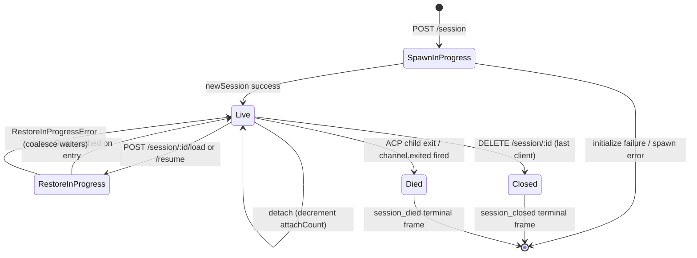

# Session Lifecycle & Identity

## Overview

A daemon **session** is one logical conversation pinned to one ACP `sessionId`. The bridge maintains a `SessionEntry` per session (see [`03-acp-bridge.md`](./03-acp-bridge.md)) which couples the ACP child connection with HTTP-side bookkeeping: prompt FIFO, model-change FIFO, event bus, pending permissions, attached clients, heartbeats, restore state, terminal-frame tombstones.

A daemon **client** is identified by `X-Qwen-Client-Id` — an opaque, daemon-validated string the HTTP caller stamps on its requests. The bridge tracks which clients are attached to which sessions, and uses the originator client id to drive the `designated` permission policy, audit trails, and event attribution.

This doc explains every session lifecycle transition (create / attach / load / resume / close / die / evict) and every identity surface the daemon exposes.

## Responsibilities

- Mint, attach, restore, and reap sessions.
- Validate `X-Qwen-Client-Id` and reject malformed ids.
- Track multiple attached clients per session (`clientIds: Map<string, count>`, `attachCount`).
- Stamp `originatorClientId` on outbound events.
- Run heartbeats so dashboards know which clients are still connected.
- Surface session metadata (`displayName`) that operators set via `PATCH /session/:id/metadata`.
- Drive terminal frame emission (`session_died`, `session_closed`, `client_evicted`, `stream_error`).

## Architecture

| Concern                   | Source                                                       | Notes                                                                                     |
| ------------------------- | ------------------------------------------------------------ | ----------------------------------------------------------------------------------------- |
| `SessionEntry`            | `packages/acp-bridge/src/bridge.ts`                          | Per-session struct; see [`03-acp-bridge.md`](./03-acp-bridge.md) for full field listing.  |
| `BridgeSession` (public)  | `packages/acp-bridge/src/bridgeTypes.ts`                     | `{ sessionId, workspaceCwd, attached, clientId?, createdAt? }` returned to HTTP handlers. |
| `BridgeSessionState`      | `packages/acp-bridge/src/bridgeTypes.ts`                     | `LoadSessionResponse \| ResumeSessionResponse` cached on the entry as `restoreState`.     |
| `DaemonSession` (SDK)     | `packages/sdk-typescript/src/daemon/types.ts`                | `{ sessionId, workspaceCwd, attached, clientId?, createdAt? }`.                           |
| Client-id validation      | `packages/acp-bridge/src/bridge.ts` (around `spawnOrAttach`) | Pattern `[A-Za-z0-9._:-]{1,128}`; `InvalidClientIdError` if malformed.                    |
| Session disconnect-reaper | `packages/cli/src/serve/server.ts`                           | Tracks spawn-owner disconnects with `attachCount` + `spawnOwnerWantedKill`.               |

### State machine



### Attach vs spawn

Under `sessionScope: 'single'` (default), the bridge's `defaultEntry` is shared by every connecting client. A `POST /session` that arrives while `defaultEntry` already exists returns `attached: true` without spawning a new ACP child. The bridge synchronously bumps `attachCount` and registers the caller's `X-Qwen-Client-Id` into `clientIds`.

Under `sessionScope: 'thread'`, each thread can mint a distinct session. The caller still respects `maxSessions`.

### Identity

`X-Qwen-Client-Id` is **optional** but **strongly recommended**. The daemon does not generate one on the caller's behalf — clients pick their own and reuse it across requests so the daemon can attribute votes, audit events, and detect reconnects.

Validation rules:

- Charset: `[A-Za-z0-9._:-]`.
- Length: 1–128.
- Outside this set: `InvalidClientIdError` (`400`).

The daemon stamps `originatorClientId` on outbound SSE events when:

1. The request that triggered the event carried `X-Qwen-Client-Id`, AND
2. The id is currently registered in the session's `clientIds` set, AND
3. The session has an `activePromptOriginatorClientId` set (inline `sessionUpdate` and `permission_request` inherit the originator from the active prompt).

Anonymous callers (no `X-Qwen-Client-Id`) work fine for `first-responder` policy; `designated` rejects their votes with `permission_forbidden{ reason: 'designated_mismatch' }`; `consensus` rejects with the same `forbidden` reason because the voter is not in the issue-time `votersAtIssue` snapshot; `local-only` is the only policy that accepts anonymous loopback voters.

## Workflow

### Create or attach

```mermaid
sequenceDiagram
    autonumber
    participant C as Client
    participant R as POST /session
    participant B as Bridge.spawnOrAttach
    participant CH as ACP child

    C->>R: POST /session<br/>X-Qwen-Client-Id: alice<br/>{cwd, sessionScope?}
    R->>R: validate clientId pattern
    R->>B: spawnOrAttach({cwd, sessionScope, clientId})
    alt single scope + defaultEntry exists
        B->>B: bump attachCount; register clientId
        B-->>R: {sessionId, attached: true, restoreState?}
    else cold
        B->>CH: spawn + ACP initialize + newSession
        CH-->>B: sessionId
        B->>B: build SessionEntry; register in byId
        B-->>R: {sessionId, attached: false}
    end
    R-->>C: 200 { sessionId, attached, ... }
```

### Load / resume

`POST /session/:id/load` — replays full ACP history (`session/load` notifications fire before the response returns).
`POST /session/:id/resume` — restores without replay (`connection.unstable_resumeSession`, exposed under the stable `session_resume` daemon capability; `unstable_session_resume` remains a deprecated alias).

Both:

1. Use a per-session `pendingRestoreIds` set on the channel so concurrent restore calls coalesce (`RestoreInProgressError`).
2. Cache `restoreState` on the entry so a late attacher gets the same payload the original restorer did.

### Heartbeat

`POST /session/:id/heartbeat` updates `sessionLastSeenAt` regardless of `clientId`. If the request carries a registered `X-Qwen-Client-Id`, `clientLastSeenAt.set(clientId, Date.now())` also updates. Per-client eviction is **not** implemented in v1; revocation is planned for F-series Wave 5. Today, heartbeats provide observability for dashboards and for the upcoming revocation policy in PR 24.

### Metadata

`PATCH /session/:id/metadata` accepts `{displayName?}`. Validation:

- Max length: `MAX_DISPLAY_NAME_LENGTH = 256`.
- Must not contain control characters (`hasControlCharacter` rejects code points ≤ 0x1f or == 0x7f).
- `InvalidSessionMetadataError` (`400`) on violation.

A successful update fans `session_metadata_updated` to every subscriber.

### Termination

| Terminal frame   | Trigger                                                                                                                                                       |
| ---------------- | ------------------------------------------------------------------------------------------------------------------------------------------------------------- |
| `session_closed` | `DELETE /session/:id` (client_close) or programmatic close.                                                                                                   |
| `session_died`   | `channel.exited` fires for any reason (crash, child kill). Carries `exitCode?` + `signalCode?` when the OS exit path was used.                                |
| `client_evicted` | Per-subscriber queue overflow on the EventBus (see [`10-event-bus.md`](./10-event-bus.md)). NOT a session-level termination — only this subscriber is closed. |
| `stream_error`   | SubscriberLimitExceededError or other route-level stream failure.                                                                                             |

Pending permissions are resolved as `{kind:'cancelled', reason:'session_closed'}` via `mediator.forgetSession(sessionId)` at every termination path.

### Disconnect-reaper guard

When the spawn-owning client's HTTP response cannot be written (TCP reset mid-handshake), the route calls `killSession({ requireZeroAttaches: true })`. If another client has already attached (`attachCount > 0`), the guard short-circuits and the session lives on. Setting `spawnOwnerWantedKill = true` remembers the intent so a later `detachClient()` that brings `attachCount` back to 0 completes the deferred reap. Without this, a fast-disconnecting spawn owner would tear down a healthy session every other reconnect.

## State & Lifecycle

`SessionEntry` fields critical to lifecycle:

| Field                            | Type                  | Meaning                                                                          |
| -------------------------------- | --------------------- | -------------------------------------------------------------------------------- |
| `clientIds`                      | `Map<string, number>` | Registered client ids → registration ref count.                                  |
| `attachCount`                    | `number`              | Times `spawnOrAttach` returned `attached: true` for this entry.                  |
| `activePromptOriginatorClientId` | `string?`             | Originator for the prompt currently running.                                     |
| `restoreState`                   | `BridgeSessionState?` | Cached load/resume response so late attachers see consistent payloads.           |
| `spawnOwnerWantedKill`           | `boolean`             | Deferred-reap tombstone (see disconnect-reaper above).                           |
| `sessionLastSeenAt`              | `number?`             | Most recent heartbeat across any client (epoch ms).                              |
| `clientLastSeenAt`               | `Map<string, number>` | Per-client heartbeat.                                                            |
| `pendingPermissionIds`           | `Set<string>`         | ACP requestIds currently pending — used on cancel/close to resolve as cancelled. |

## Dependencies

- ACP layer: `connection.newSession`, `connection.unstable_resumeSession`, `connection.loadSession`.
- [`03-acp-bridge.md`](./03-acp-bridge.md) for the surrounding bridge architecture.
- [`04-permission-mediation.md`](./04-permission-mediation.md) for how originator + identity drive policy decisions.
- [`10-event-bus.md`](./10-event-bus.md) for terminal-frame delivery.

## Additional session endpoints

These endpoints extend the base lifecycle surface:

### Non-blocking Prompt (`non_blocking_prompt` capability tag)

`POST /session/:id/prompt` now returns HTTP **202** with
`{ promptId, lastEventId }` instead of blocking until the prompt completes. The
actual result arrives on SSE as `turn_complete` / `turn_error`, and the
`promptId` field correlates those events with the 202 response.
`DaemonSessionClient.prompt()` automatically uses the non-blocking path when it
has an active event subscription and transparently matches the result from the
SSE stream.

### Session Recap (`session_recap` capability tag)

`POST /session/:id/recap` asks the fast model for a one-line "where did I leave
off" summary. It returns `{ sessionId, recap: string | null }`; `null` means the
history was too short or the model failed temporarily. This endpoint is
best-effort.

### Session BTW / Side Question (`session_btw` capability tag)

`POST /session/:id/btw` asks a one-off question against the session context
without interrupting the main conversation flow. It uses `runForkedAgent` on the
cache path for a single-turn, no-tool LLM call and returns
`{ sessionId, answer: string | null }`. The implementation enforces
`BTW_MAX_INPUT_LENGTH`, cross-session leakage guards, and timeout handling.

### Shell Command Execution

`POST /session/:id/shell` executes a shell command directly on the daemon host,
without routing through the LLM. It streams output on the session SSE bus via
`user_shell_command` / `user_shell_result` events and injects the command plus
result into the LLM conversation history. The response is
`{ exitCode, output, aborted }`.

### Session Detach

`POST /session/:id/detach` explicitly detaches a client from a session by
decrementing `attachCount`; it does not close the session by itself. If no other
attach or subscriber remains, the session is reaped. The endpoint returns 204.

### Batch Session Delete

`POST /sessions/delete` accepts `{ sessionIds: string[] }` (up to 100 ids),
closes bridge sessions, and deletes transcript files. It uses
`Promise.allSettled` for resilience and returns `{ removed, notFound, errors }`.

### Context Usage (`session_context_usage` capability tag)

`GET /session/:id/context-usage` returns structured context-window usage.
`?detail=true` includes finer-grained usage grouped by tool, memory, and skill.

### Session Stats (`session_stats` capability tag)

`GET /session/:id/stats` returns usage statistics: model metrics
(input/output tokens, cache reads/writes, total cost), per-tool call counts and
latencies, and file edit counts.

### Session Tasks (`session_tasks` capability tag)

`GET /session/:id/tasks` returns a background-task snapshot for agent tasks,
shell tasks, monitor tasks, and their lifecycle states.

### Session LSP Status (`session_lsp` capability tag)

`GET /session/:id/lsp` returns sanitized per-session LSP status for daemon
clients: enablement, aggregate server counts, unavailable/initialization state,
and per-server `name`, `status`, `languages`, `transport`, `command`, and
`error`. Disabled or unavailable LSP is represented as HTTP 200 status data,
not as a transport error.

### Compacted Replay

`POST /session/:id/load` now returns a `BridgeRestoredSession` that can include
`compactedReplay?: BridgeEvent[]`, `liveJournal?: BridgeEvent[]`, and
`lastEventId?: number`. `compactedReplay` is produced by
`TurnBoundaryCompactionEngine`: at turn boundaries it folds consecutive text /
thought blocks, collapses tool-call sequences to their final state, discards
transient signals, and produces O(turns) replay logs instead of O(tokens) logs
(typically a 25-30x reduction).

### ACP Child Preheat

`bridge.preheat()` warms the ACP child process before the first session so that
the first real session avoids cold-start latency. It pairs with
`channelIdleTimeoutMs`, which keeps the ACP child alive after the last session
closes, and skip-relaunch behavior, which reuses an already idle child when a
new session arrives.

## Configuration

- `BridgeOptions.maxSessions` (default 20) — cap.
- `BridgeOptions.sessionScope` (default `'single'`; optional `'thread'`).
- `BridgeOptions.initializeTimeoutMs` (default 10s) — ACP `initialize` handshake.
- `BridgeOptions.channelIdleTimeoutMs` (default 0; reap the ACP child immediately).
- Capability tags: `session_create`, `session_scope_override`, `session_load`, `session_resume`, `unstable_session_resume` (deprecated alias), `session_list`, `session_close`, `session_metadata`, `session_set_model`, `client_identity`, `client_heartbeat`, `session_recap`, `session_btw`, `session_context_usage`, `session_tasks`, `session_stats`, `session_lsp`, `non_blocking_prompt`.

## Caveats & Known Limits

- `connection.unstable_resumeSession` may still be unstable at the ACP layer, but the daemon advertises the committed v1 route contract with `session_resume`. `unstable_session_resume` is kept only as a deprecated compatibility alias.
- v1 has **no per-client eviction**; only per-session and per-subscriber termination. Revocation policy is F-series Wave 5 / PR 24.
- `client_evicted` is per-subscriber, not per-session. A client whose SSE subscriber was evicted can reconnect.
- Anonymous clients (no `X-Qwen-Client-Id`) cannot vote under `designated` or `consensus` policies.

## References

- `packages/acp-bridge/src/bridge.ts` (SessionEntry definition)
- `packages/acp-bridge/src/bridgeTypes.ts` (`HttpAcpBridge`, `BridgeSession`, `BridgeSessionState`)
- `packages/sdk-typescript/src/daemon/types.ts` (`DaemonSession`)
- `packages/sdk-typescript/src/daemon/DaemonSessionClient.ts`
- Wire reference: [`../qwen-serve-protocol.md`](../qwen-serve-protocol.md) (route catalogue).
