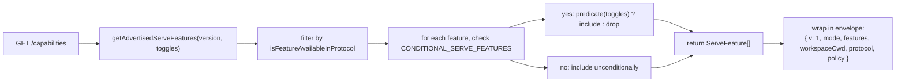
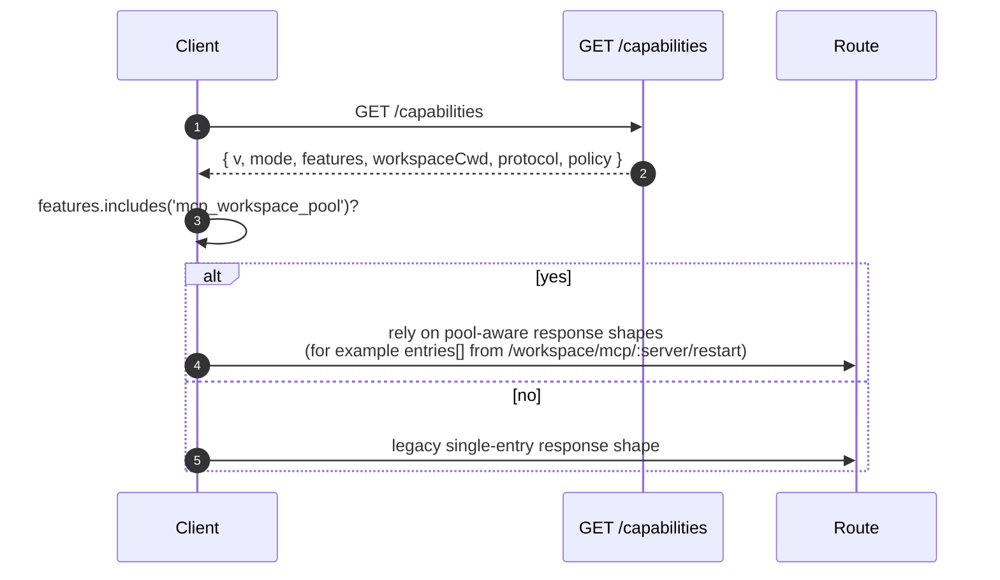

# Capabilities & Protocol Versioning

## Overview

`GET /capabilities` is the daemon preflight endpoint. Every SDK client should read it before calling any other route so it can learn which protocol version the daemon speaks, which feature tags are enabled, and which workspace the daemon is bound to. The contract:

- **There is one protocol version: `v1`.** `SERVE_PROTOCOL_VERSION = 'v1'` and `SUPPORTED_SERVE_PROTOCOL_VERSIONS = ['v1']`. v1 is additive internally; breaking frame-shape changes are reserved for v2.
- **Each tag has a `since` version.** Future v2 daemons can advertise both v1 and v2 tags.
- **Some tags are conditional.** Ten tags (`require_auth`, `mcp_workspace_pool`, `mcp_pool_restart`, `allow_origin`, `prompt_absolute_deadline`, `writer_idle_timeout`, `workspace_settings`, `session_shell_command`, `rate_limit`, `workspace_reload`) are advertised only when the corresponding deployment toggle is enabled. Tag presence means the behavior exists.
- **Capability tag = behavior contract.** Adding new behavior under an existing tag can silently break clients that preflighted the old tag. New behavior needs a new tag.

The complete registry lives in `packages/cli/src/serve/capabilities.ts`.

## Responsibilities

- Declare every feature the daemon may advertise.
- Filter advertised features by protocol version and deployment toggles.
- Expose `getRegisteredServeFeatures()` (all keys, unfiltered), `getAdvertisedServeFeatures(version, toggles)` (filtered), and `getServeProtocolVersions()` (envelope `{ current, supported }`).
- Preserve the invariant "tag present means behavior present". `server.test.ts` includes a test that every conditional tag advertises when its toggle is on; adding a conditional tag without a predicate fails that test.

## Architecture

### Capability envelope

`/capabilities` returns:

```ts
{
  v: 1,                    // CAPABILITIES_SCHEMA_VERSION
  mode: 'http-bridge',
  features: ServeFeature[],
  workspaceCwd: string,
  protocol?: { current: 'v1', supported: ['v1'] },
  policy?: { permission: PermissionPolicy },
}
```

`workspaceCwd` is the canonical workspace bound at daemon boot (see [`02-serve-runtime.md`](./02-serve-runtime.md)). `policy.permission` is the active mediator policy.

### `ServeCapabilityDescriptor`

```ts
interface ServeCapabilityDescriptor {
  since: ServeProtocolVersion; // current = 'v1'
  modes?: readonly string[]; // lists operation modes when a feature has modes
}
```

Two v1 tags use `modes`:

- `mcp_guardrails: { since: 'v1', modes: ['warn', 'enforce'] }` - clients should preflight `'enforce'` before relying on refusal behavior.
- `permission_mediation: { since: 'v1', modes: ['first-responder', 'designated', 'consensus', 'local-only'] }` - this is the build-time supported set; the active policy is in `policy.permission`.

### Conditional tags

```ts
export const CONDITIONAL_SERVE_FEATURES: ReadonlyMap<
  ServeFeature,
  (toggles: AdvertiseFeatureToggles) => boolean
> = new Map([
  ['require_auth', (t) => t.requireAuth === true],
  ['mcp_workspace_pool', (t) => t.mcpPoolActive === true],
  ['mcp_pool_restart', (t) => t.mcpPoolActive === true],
  ['allow_origin', (t) => t.allowOriginActive === true],
  [
    'prompt_absolute_deadline',
    (t) => typeof t.promptDeadlineMs === 'number' && t.promptDeadlineMs > 0,
  ],
  [
    'writer_idle_timeout',
    (t) =>
      typeof t.writerIdleTimeoutMs === 'number' && t.writerIdleTimeoutMs > 0,
  ],
  ['workspace_settings', (t) => t.persistSettingAvailable === true],
  ['session_shell_command', (t) => t.sessionShellCommandEnabled === true],
  ['rate_limit', (t) => t.rateLimit === true],
  ['workspace_reload', (t) => t.reloadAvailable === true],
]);
```

The `Map` stores membership and predicate together. Adding a new conditional tag requires two coordinated changes:

1. Register the tag and its `since` version in `SERVE_CAPABILITY_REGISTRY`.
2. Add its predicate to `CONDITIONAL_SERVE_FEATURES`.

Baseline tags are not present in the `Map` and are advertised unconditionally. This is intentionally represented by absence rather than by a separate Set.

### 67 tags (v1, grouped by domain)

Foundation: `health`, `capabilities`.

Sessions: `session_create`, `session_scope_override`, `session_load`, `session_resume`, `unstable_session_resume`, `session_list`, `session_prompt`, `session_cancel`, `session_events`, `session_set_model`, `session_close`, `session_metadata`, `session_context`, `session_context_usage`, `session_supported_commands`, `session_tasks`, `session_stats`, `session_lsp`, `session_approval_mode_control`, `session_recap`, `session_btw`, **`session_shell_command`** (conditional), `session_language`, `session_rewind`, `session_hooks`, `session_branch`.

Streaming: `slow_client_warning`, `typed_event_schema`.

Identity and heartbeat: `client_identity`, `client_heartbeat`.

Permissions: `session_permission_vote`, `permission_vote`, **`permission_mediation`** (`modes: ['first-responder', 'designated', 'consensus', 'local-only']`).

Workspace read-only snapshots: `workspace_mcp`, `workspace_skills`, `workspace_providers`, `workspace_env`, `workspace_preflight`, `workspace_hooks`, `workspace_extensions`.

Workspace mutation (Wave 4+): `workspace_memory`, `workspace_agents`, `workspace_agent_generate`, `workspace_tool_toggle`, **`workspace_settings`** (conditional), `workspace_init`, `workspace_mcp_restart`, `workspace_mcp_manage`, `workspace_file_read`, `workspace_file_bytes`, `workspace_file_write`, **`workspace_reload`** (conditional).

MCP guardrails: **`mcp_guardrails`** (`modes: ['warn', 'enforce']`), `mcp_guardrail_events`, `mcp_server_runtime_mutation`, **`mcp_workspace_pool`** (conditional), **`mcp_pool_restart`** (conditional).

Prompt control: **`prompt_absolute_deadline`** (conditional), **`writer_idle_timeout`** (conditional), `non_blocking_prompt`.

Auth: `auth_provider_install`, `auth_device_flow`, **`require_auth`** (conditional), **`allow_origin`** (conditional).

Rate limiting: **`rate_limit`** (conditional).

Bold tags have `modes` or are conditional.

## Flow

### Daemon side: assemble envelope



### Client side: feature preflight



## State and lifecycle

- `CAPABILITIES_SCHEMA_VERSION` is the wire envelope shape version, currently `1`. Bump it only for an envelope break.
- `SERVE_PROTOCOL_VERSION = 'v1'` is the protocol-feature version. Adding features inside v1 is additive; old clients do not see new behavior unless they preflight the new tag. Removing a feature is a v2 break.
- `EVENT_SCHEMA_VERSION = 1` is the SSE frame `v` field (see [`09-event-schema.md`](./09-event-schema.md)). It is an independent version axis; bumping event schema does not imply bumping protocol version, and vice versa.
- `session_resume` is the stable daemon capability for `POST /session/:id/resume`. `unstable_session_resume` remains advertised as a deprecated alias because the underlying ACP method is still named `connection.unstable_resumeSession`; new clients should feature-detect `session_resume`.

## Dependencies

- Read by `packages/cli/src/serve/server.ts` when building `/capabilities` responses.
- Toggle input comes from `runQwenServe` / `createServeApp`: `{ requireAuth, mcpPoolActive, allowOriginActive, promptDeadlineMs, writerIdleTimeoutMs, persistSettingAvailable, sessionShellCommandEnabled, rateLimit, reloadAvailable }`.
- The active `permission` policy in the envelope comes from `BridgeOptions.permissionPolicy`, which itself reads `settings.json` `policy.permissionStrategy`.

## Configuration

| Source                     | Knob                                                            | Effect on capabilities                                                                                                        |
| -------------------------- | --------------------------------------------------------------- | ----------------------------------------------------------------------------------------------------------------------------- |
| CLI flag                   | `--require-auth`                                                | Advertises `require_auth`.                                                                                                    |
| Env                        | `QWEN_SERVE_NO_MCP_POOL=1`                                      | Stops advertising `mcp_workspace_pool` and `mcp_pool_restart`; MCP events no longer stamp `scope: 'workspace'`.               |
| CLI flag                   | `--mcp-client-budget=N`, `--mcp-budget-mode={off,warn,enforce}` | Does not change the tag set (`mcp_guardrails` is always advertised), but changes per-server reservation and refusal behavior. |
| CLI flag / env             | `--rate-limit` / `QWEN_SERVE_RATE_LIMIT=1`                      | Advertises `rate_limit`.                                                                                                      |
| Embedded option            | `persistSettingAvailable`                                       | Advertises `workspace_settings`.                                                                                              |
| CLI flag / embedded option | `--enable-session-shell` / `sessionShellCommandEnabled`         | Advertises `session_shell_command`.                                                                                           |
| Embedded option            | `reloadAvailable`                                               | Advertises `workspace_reload`.                                                                                                |
| `settings.json`            | `policy.permissionStrategy`                                     | Sets envelope `policy.permission`.                                                                                            |

## Caveats and known limits

- **`--require-auth` hides preflight.** With `--require-auth`, all routes, including `/capabilities`, require bearer auth. An unauthenticated client cannot preflight `caps.features.require_auth`; the 401 response body is the discovery surface. The `require_auth` tag is an authenticated confirmation for hardened-deployment audit UIs.
- **Tag presence means behavior exists.** If a future contributor adds behavior under an existing tag without bumping `since`, clients that preflighted the old tag can silently receive new behavior. The convention is: new behavior gets a new tag.
- **`unstable_*` tags can change shape between versions** without a protocol bump. Pin an SDK version when depending on them.
- The route catalog lives in [`../qwen-serve-protocol.md`](../qwen-serve-protocol.md); this page intentionally does not duplicate it.

## References

- `packages/cli/src/serve/capabilities.ts`
- `packages/cli/src/serve/types.ts` (`ServeOptions`, `CapabilitiesEnvelope`)
- `packages/cli/src/serve/server.ts` (envelope assembly)
- `packages/acp-bridge/src/eventBus.ts` (`EVENT_SCHEMA_VERSION`)
- Wire reference: [`../qwen-serve-protocol.md`](../qwen-serve-protocol.md)
- Auth and deployment guardrails: [`12-auth-security.md`](./12-auth-security.md)
