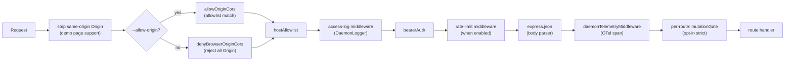
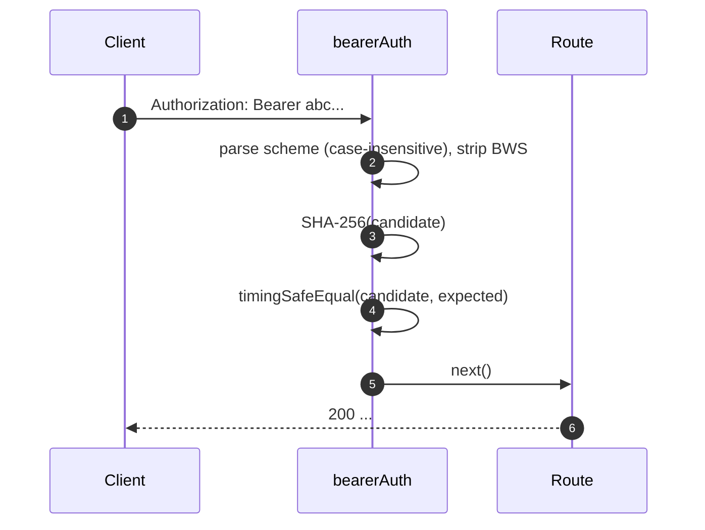
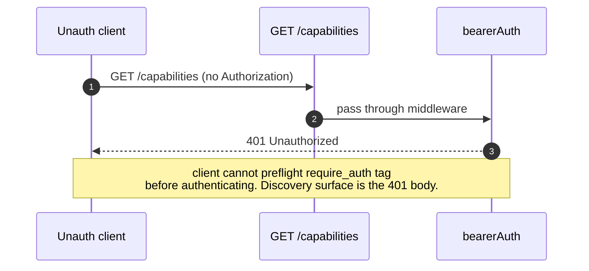
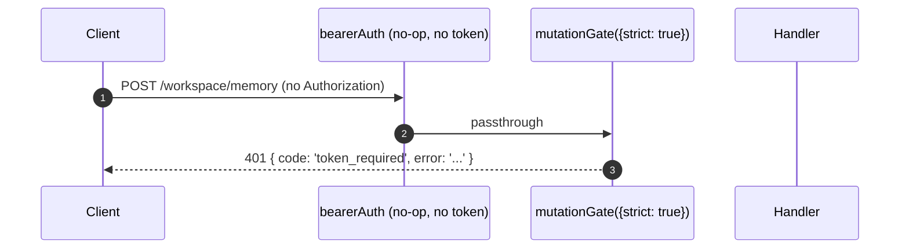

# Auth & Security Model

## Overview

`qwen serve` is a local daemon by default and an exposed surface in the wrong configuration. Its security model is **layered** so that misconfiguration fails closed:

1. **Bind** — non-loopback bind without a bearer token **refuses to start**.
2. **Bearer auth** — `bearerAuth` middleware with constant-time SHA-256 compare protects every route except `/health` on loopback (`require_auth` extends this to loopback and `/health` too).
3. **Host header allowlist** — on loopback, only `localhost`, `127.0.0.1`, `[::1]`, `host.docker.internal` (plus port) are accepted; defense against DNS rebinding.
4. **Origin control** — by default, any request carrying an `Origin` header is rejected with 403. When `--allow-origin <pattern>` is configured, the daemon switches to CORS allowlist mode (`allowOriginCors`) and only permits matching origins.
5. **Per-route mutation gate** — Wave 4 mutating routes can opt in to `401` responses even on loopback when no token is configured, using a distinct `code: 'token_required'` error.
6. **Device-flow auth** — separate OAuth surface for providers (`POST /workspace/auth/device-flow` + GET/DELETE on `/:id`).

This doc walks through each layer and the explicit invariants the boot path enforces.

## Responsibilities

- Refuse to boot in unsafe configurations.
- Gate every HTTP request through bearer (when configured) + host (loopback) + origin checks.
- Provide a per-route mutation gate Wave 4 routes opt into.
- Host the device-flow registry that drives provider OAuth flows visible via SSE events.

## Architecture

### Boot-time refuse rules

In `run-qwen-serve.ts`:

```ts
if (!isLoopbackBind(opts.hostname) && !token) {
  throw new Error('Refusing to bind <host>:<port> without a bearer token. ...');
}
if (opts.requireAuth && !token) {
  throw new Error(
    'Refusing to start with --require-auth set but no bearer token configured. ...',
  );
}
```

The allow-origin wildcard has its own refuse rule:

```ts
const parsed = parseAllowOriginPatterns(opts.allowOrigins);
if (parsed.allowAny && !token) {
  throw new Error(
    "Refusing to start with --allow-origin '*' but no bearer token configured. ...",
  );
}
```

All three refusals are explicit boot failures (visible in stderr / thrown to the embedder),
never silent. The threat model from #3803 explicitly forbids silently letting a
daemon bind beyond loopback in the open.

### Middleware chain (HTTP request order)



`mutationGate` is a per-route middleware factory (`createMutationGate` returns
`mutate()`); routes call `mutate()` or `mutate({strict: true})` at registration
time. It is not a global `app.use()` middleware. Access logging is registered
before `bearerAuth` so 401 rejects are still logged. Rate limiting runs after
`bearerAuth` and before `express.json()`, so only authenticated requests count
and large bodies are rejected before parsing when a limit is exceeded.

### `bearerAuth`

- **No token configured** → middleware is a no-op (loopback developer default).
- **Token configured** → SHA-256 the configured token once at construction; on every request hash the candidate and `timingSafeEqual` compare. No string-equality short-circuit; no time-leak.
- **Scheme parsing**: case-insensitive `Bearer` per RFC 7235 §2.1; tolerant of `SP\tHTAB` between scheme and credentials per RFC 7230 §3.2.6 BWS; rejects pure-HTAB-as-separator.
- **CodeQL hardening**: hand-rolled `indexOf` parsing rather than regex with `\s+` / `.+` overlap (no polynomial-regex risk).

### `hostAllowlist`

Loopback-only. Maintains a `Set<string>` keyed by port. Allowed Hosts:

- `localhost:<port>`, `127.0.0.1:<port>`, `[::1]:<port>`, `host.docker.internal:<port>`.
- Plus no-port forms (`localhost`, `127.0.0.1`, `[::1]`, `host.docker.internal`) **only** when bound to port 80 (per RFC 7230 §5.4 default-port omission).

Host comparison is **case-insensitive** — Express normalizes header names but not values, so Docker proxies that capitalize Hosts (`Localhost:4170`, `HOST.docker.internal`) would 403 with an exact-string compare.

Non-loopback binds bypass this middleware (operator chose the surface area; bearer token gates Host spoofing instead).

### `denyBrowserOriginCors`

Reject any request with an `Origin` header. CLI/SDK never set Origin; only browsers do. Returns deterministic `403 { error: 'Request denied by CORS policy' }` rather than the 500 HTML the `cors` package's error-callback would produce.

Exception: the demo page's same-origin XHRs are handled by a separate middleware (in `server.ts`) that strips `Origin` when it matches the daemon's own address.

### `allowOriginCors` (`--allow-origin` mode)

When `--allow-origin <pattern>` is configured, `denyBrowserOriginCors` is
replaced with `allowOriginCors(parsedPatterns)`:

- Matching `Origin` values receive `Access-Control-Allow-Origin`,
  `Access-Control-Allow-Headers`, and `Access-Control-Allow-Methods`; `OPTIONS`
  preflight returns `204`.
- Non-matching `Origin` values receive the same deterministic
  `403 { error: 'Request denied by CORS policy' }` as deny mode.
- `--allow-origin '*'` requires `--token`; otherwise boot refuses.
- `parseAllowOriginPatterns()` validates pattern syntax at boot.
- The `allow_origin` capability tag is advertised only when this mode is
  configured.

### `createMutationGate`

Per-route opt-in gate. Behavior matrix:

| daemon config           | route opts      | result                           |
| ----------------------- | --------------- | -------------------------------- |
| `requireAuth=true`      | any             | passthrough¹                     |
| `token` configured      | any             | passthrough²                     |
| no token (loopback dev) | `strict: false` | passthrough                      |
| no token (loopback dev) | `strict: true`  | `401 { code: 'token_required' }` |

¹ `--require-auth` boots only with a token, so global `bearerAuth` already 401'd unauthenticated callers.
² Any token configuration makes global `bearerAuth` enforce bearer-required-everywhere; the gate is redundant but harmless.

The `code: 'token_required'` shape is distinct from `bearerAuth`'s plain `Unauthorized` so SDK clients can render a "configure --token / --require-auth" hint instead of a generic 401.

**Wave 4+ strict routes**: `/workspace/memory`, `/workspace/agents/*`,
`/workspace/agents/generate`, `/file/write`, `/file/edit`,
`/workspace/tools/:name/enable`, `/workspace/mcp/:server/restart`,
`/workspace/mcp/:server/{enable,disable,authenticate,clear-auth}`,
`/workspace/mcp/servers` (POST/DELETE), `/workspace/auth/device-flow`,
`/workspace/init`, `/session/:id/approval-mode`.

### `/health` exemption

On loopback binds, `/health` is registered **before** the bearer middleware so liveness probes inside the pod do not need to carry the token. Non-loopback binds gate `/health` behind bearer like every other route. `--require-auth` drops the exemption: `/health` requires `Authorization: Bearer <token>` on loopback too.

### v1 client identity (`X-Qwen-Client-Id`) is self-reported

The daemon validates only the format of `X-Qwen-Client-Id`
(`[A-Za-z0-9._:-]{1,128}`) and tracks attached client ids per session. It does
not currently perform proof-of-possession. A client that observes
`originatorClientId` on SSE can re-register the same id and impersonate that
originator in later requests.

Impact:

- `designated` — a remote caller can impersonate the originator and vote on a
  request intended only for the prompt originator.
- `consensus` — if the spoofed id was already in the `votersAtIssue` snapshot,
  it can vote.
- `local-only` is not affected because it gates on `fromLoopback`, which the
  daemon stamps from the connection remote address.
- `first-responder` is not affected because it is identity-agnostic.

A future pair-token mechanism will issue a per-session secret from
`POST /session`; `designated` / `consensus` votes will have to present it. Until
then, deployments that need a hardened designated policy should bind loopback
or run behind an authenticated reverse proxy. See
[`04-permission-mediation.md`](./04-permission-mediation.md) for policy-level
details.

### Device-flow auth

Separate OAuth surface for provider authentication. The v1 provider identifier is
`qwen-oauth`, but Qwen OAuth free tier was discontinued on 2026-04-15; new
setups should use a currently supported auth provider when one is available.

- `POST /workspace/auth/device-flow` — start a flow; returns `{deviceFlowId, providerId, expiresAt, verificationUrl, userCode}`.
- `GET /workspace/auth/device-flow/:id` — poll state.
- `DELETE /workspace/auth/device-flow/:id` — cancel.
- `GET /workspace/auth/status` — current account / provider snapshot.

SSE events `auth_device_flow_{started, throttled, authorized, failed, cancelled}` fan-out flow state to all subscribers so multi-client UIs stay in sync. See [`09-event-schema.md`](./09-event-schema.md).

Implementation: `packages/cli/src/serve/auth/device-flow.ts` + `qwen-device-flow-provider.ts`.

**Log injection / Trojan Source defense**: `sanitizeForStderr(value)`
(`device-flow.ts`) replaces ASCII control characters and Unicode control
characters with `?`. A malicious IdP could otherwise forge log lines or hide
payloads:

| Range                            | Why it is stripped                                                                                                                                                                                                                                                  |
| -------------------------------- | ------------------------------------------------------------------------------------------------------------------------------------------------------------------------------------------------------------------------------------------------------------------- |
| `\x00–\x1f`, `\x7f`, `\x80–\x9f` | ASCII C0 / DEL / C1 controls, terminal escapes, and log-line forging.                                                                                                                                                                                               |
| U+200B-U+200F                    | Zero-width characters plus LRM / RLM; invisible but can change terminal rendering.                                                                                                                                                                                  |
| U+2028-U+2029                    | LINE / PARAGRAPH SEPARATOR; many Unicode-aware terminals treat them as line breaks.                                                                                                                                                                                 |
| U+202A-U+202E                    | Bidirectional EMBEDDING / OVERRIDE controls.                                                                                                                                                                                                                        |
| U+2066-U+2069                    | Bidirectional ISOLATE controls (LRI / RLI / FSI / PDI), the main [CVE-2021-42574 "Trojan Source"](https://trojansource.codes/) vector. An IdP using U+2066 (LRI) instead of U+202D (LRO) can bypass EMBEDDING/OVERRIDE-only filters with similar visual reordering. |
| U+FEFF                           | BOM / zero-width no-break space.                                                                                                                                                                                                                                    |

Length is preserved by replacing each stripped code point with `?` rather than
deleting it, so operators can still see that something was present at that
index. Both layers use the sanitizer: `qwenDeviceFlowProvider` sanitizes IdP
`oauthError`, and the registry's late-poll observer sanitizes provider-controlled
values interpolated into audit hints (`latePollResult.kind` / `lateErr.name`).

The `auth_device_flow` capability tag is advertised **unconditionally**; the routes themselves return `400 unsupported_provider` if the daemon cannot satisfy a specific provider. The supported-providers list is on `/workspace/auth/status` rather than `/capabilities` to keep the descriptor shape uniform.

## Workflow

### Bearer auth successful request



### Bearer auth failure modes

All return `401 { error: 'Unauthorized' }` (uniform across `missing header` / `wrong scheme` / `wrong token` so probing cannot distinguish).

### `--require-auth` shadow



After authenticating, `caps.features.includes('require_auth')` confirms the deployment is hardened.

### Wave 4 mutation gate on no-token loopback



## State & Lifecycle

- Bearer token is read at boot and trimmed (newlines from `cat token.txt` would otherwise silently break comparison).
- Allowed-Host Set is cached per port; rebuilt on port change (ephemeral `0` → real port post-`listen`).
- Mutation gate constructs `passthrough` and `strictDenier` once per app build; per-route call returns the cached closure (no per-request allocation).
- Device-flow registry is disposed on `shutdown()` Phase 1 so pending flows resolve as `cancelled` before HTTP teardown.

## Dependencies

- `node:crypto` — `createHash`, `timingSafeEqual`.
- `packages/cli/src/serve/loopback-binds.ts` — `isLoopbackBind`.
- `packages/cli/src/serve/auth/device-flow.ts` — device-flow state machine.
- `@qwen-code/acp-bridge` — surfaces device-flow events on the per-session SSE bus.

## Configuration

| Source          | Knob                                                                                    | Effect                                                                  |
| --------------- | --------------------------------------------------------------------------------------- | ----------------------------------------------------------------------- |
| Env             | `QWEN_SERVER_TOKEN`                                                                     | Bearer token (trimmed).                                                 |
| Flag            | `--token`                                                                               | Bearer token (overrides env).                                           |
| Flag            | `--require-auth`                                                                        | Extends bearer to loopback + `/health`. Boots only with a token.        |
| Flag            | `--hostname`                                                                            | Non-loopback bind requires `--token` (or env).                          |
| Flag            | `--allow-origin <pattern>`                                                              | Switch to CORS allowlist mode. `'*'` requires a token.                  |
| Capability tags | `require_auth` (conditional), `auth_device_flow` (always), `allow_origin` (conditional) | See [`11-capabilities-versioning.md`](./11-capabilities-versioning.md). |

## Caveats & Known Limits

- **`--require-auth` shadows feature preflight.** Unauthenticated clients cannot discover the `require_auth` tag; their discovery surface is the 401 body itself.
- **Mutation gate body-parser ordering**: `mutationGate({strict: true})` 401 responses fire **after** `express.json()` parses the body. Worst case on a saturated loopback listener: `--max-connections × express.json({limit: '10mb'})` ≈ 2.5 GB transient. Loopback-only attack surface, intentionally accepted.
- **Same-origin Origin stripping** in `server.ts` happens _before_ `denyBrowserOriginCors`. If a future change moves the strip elsewhere, the demo page breaks.
- **Token comparison is over the SHA-256 digest**, not the raw token. Reduces timing leakage by collapsing variable-length token compares to a fixed-size digest compare.
- The daemon does **not** carry mTLS, request signing, or pair-token proof-of-possession today. `--rate-limit` provides HTTP rate limiting by client-id / IP key; it is not client identity authentication.

## References

- `packages/cli/src/serve/auth.ts` (entire file)
- `packages/cli/src/serve/run-qwen-serve.ts` (refuse rules)
- `packages/cli/src/serve/loopback-binds.ts`
- `packages/cli/src/serve/auth/device-flow.ts`
- `packages/cli/src/serve/auth/qwen-device-flow-provider.ts`
- User-facing threat model: [`../../users/qwen-serve.md`](../../users/qwen-serve.md).
- Wire reference: [`../qwen-serve-protocol.md`](../qwen-serve-protocol.md).
