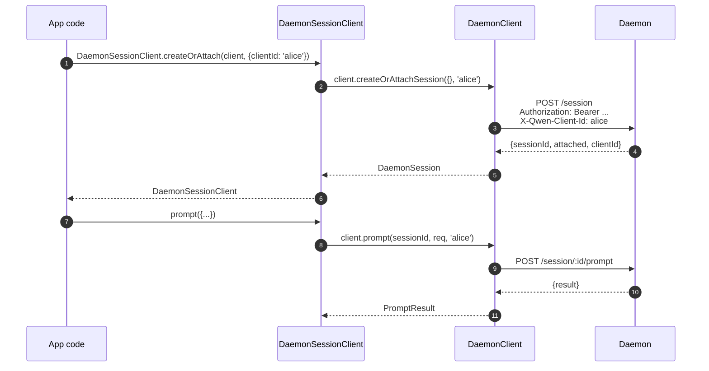
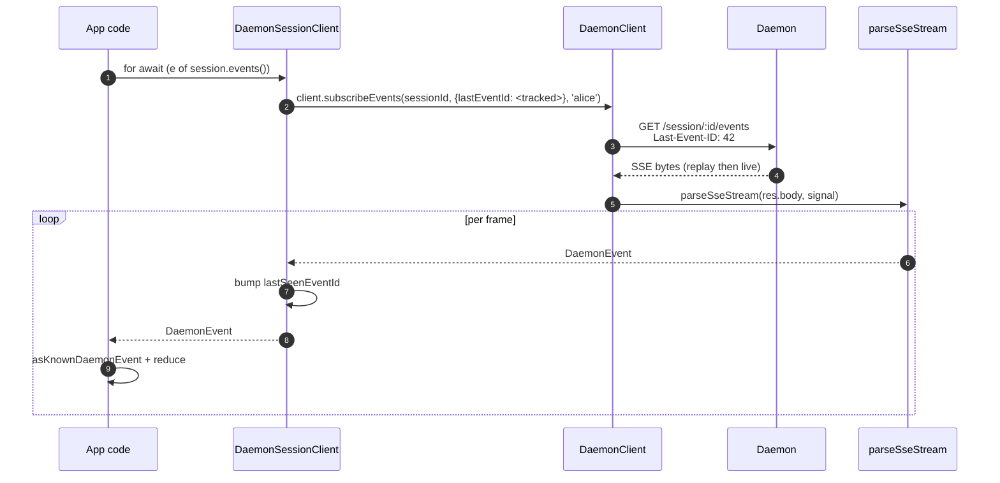
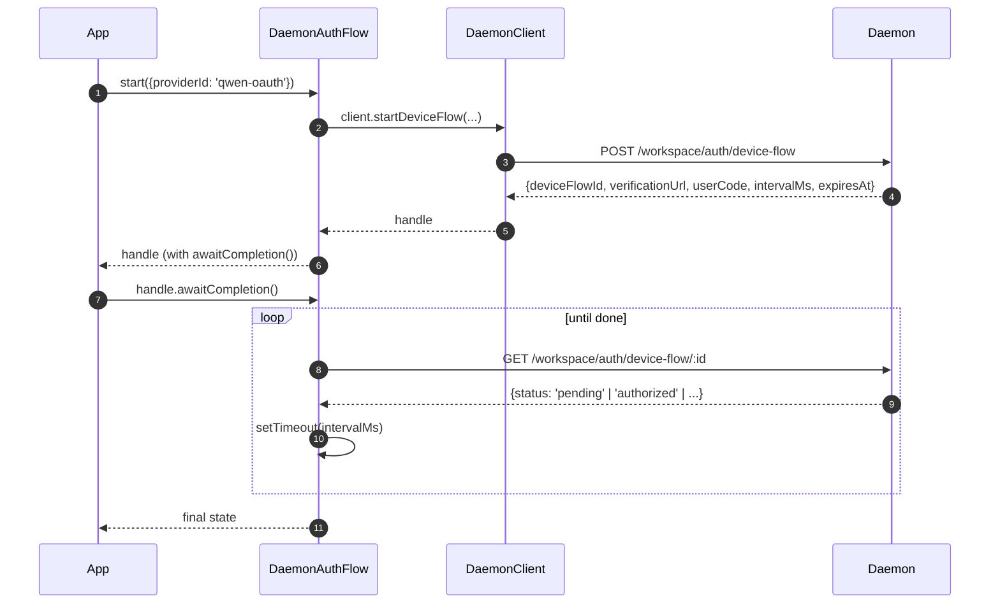

# TypeScript SDK Daemon Client

## Overview

`packages/sdk-typescript/src/daemon/` is the **TypeScript SDK's daemon client**. It is the canonical way to connect to a running `qwen serve` daemon from any TypeScript / JavaScript host (the CLI's own TUI adapter, channel bot backends, the VS Code IDE companion, custom scripts, and server-side web backends). All other adapters depend on it.

The package layout is intentionally small:

| File                     | Surface                                                                                                                        |
| ------------------------ | ------------------------------------------------------------------------------------------------------------------------------ |
| `index.ts`               | Public barrel (`DaemonClient`, `DaemonSessionClient`, `DaemonAuthFlow`, `parseSseStream`, event reducers, types).              |
| `DaemonClient.ts`        | Low-level HTTP/SSE facade — one method per `qwen-serve-protocol.md` route.                                                     |
| `DaemonSessionClient.ts` | Session-scoped wrapper with SSE replay tracking.                                                                               |
| `DaemonAuthFlow.ts`      | High-level OAuth device-flow helper.                                                                                           |
| `sse.ts`                 | `parseSseStream` (NDJSON / SSE framing parser).                                                                                |
| `events.ts`              | `asKnownDaemonEvent`, `reduceDaemonSessionEvent`, `reduceDaemonAuthEvent` (see [`09-event-schema.md`](./09-event-schema.md)).  |
| `types.ts`               | `DaemonCapabilities`, `DaemonSession`, `DaemonEvent`, `PermissionResponse`, `PromptResult`, MCP / agent / memory / auth types. |

The walkthrough example is at [`../examples/daemon-client-quickstart.md`](../examples/daemon-client-quickstart.md); this doc is the architecture and contract reference.

## Responsibilities

- Provide one TypeScript method per daemon HTTP route.
- Stamp the bearer token + `X-Qwen-Client-Id` correctly on every request.
- Compose per-call timeouts with caller-supplied `AbortSignal` (without killing long-lived SSE).
- Stream and parse SSE frames into typed `DaemonEvent`s.
- Track `lastSeenEventId` per session so reconnects replay correctly.
- Expose a device-flow auth surface that polls at daemon-supplied intervals.

## Architecture

### `DaemonClient` (`DaemonClient.ts`)

Constructor:

```ts
new DaemonClient({
  baseUrl: string,                  // default 'http://127.0.0.1:4170'
  token?: string,
  fetch?: typeof globalThis.fetch,  // injectable for tests
  fetchTimeoutMs?: number,          // 0 = disabled; default DEFAULT_FETCH_TIMEOUT_MS
});
```

Method groups (every method takes an optional `clientId` to stamp `X-Qwen-Client-Id`):

| Group               | Methods                                                                                                                                                                                                                             |
| ------------------- | ----------------------------------------------------------------------------------------------------------------------------------------------------------------------------------------------------------------------------------- |
| Plumbing            | `health()`, `capabilities()`, `auth` (lazy `DaemonAuthFlow` accessor)                                                                                                                                                               |
| Sessions            | `createOrAttachSession`, `loadSession`, `resumeSession`, `listSessions`, `closeSession`, `setSessionMetadata`, `getSessionContext`, `getSessionSupportedCommands`, `setSessionApprovalMode`, `setSessionModel`                      |
| Prompting           | `prompt`, `cancel`, `heartbeat`                                                                                                                                                                                                     |
| Events              | `subscribeEvents` (SSE generator), `subscribeEventsStream` (raw response)                                                                                                                                                           |
| Permissions         | `respondToPermission`, `respondToSessionPermission`                                                                                                                                                                                 |
| Workspace snapshots | `getWorkspaceMcp`, `getWorkspaceSkills`, `getWorkspaceProviders`, `getWorkspaceEnv`, `getWorkspacePreflight`                                                                                                                        |
| Workspace mutations | `writeWorkspaceMemory`, `readWorkspaceMemory`, `listWorkspaceAgents`, `getWorkspaceAgent`, `createWorkspaceAgent`, `updateWorkspaceAgent`, `deleteWorkspaceAgent`, `toggleWorkspaceTool`, `restartMcpServer`, `initializeWorkspace` |
| Files               | `readFile`, `readFileBytes`, `writeFile`, `editFile`, `listDirectory`, `globPaths`, `statPath`                                                                                                                                      |
| Auth                | `startDeviceFlow`, `pollDeviceFlow`, `cancelDeviceFlow`, `getAuthStatus`                                                                                                                                                            |

### `fetchWithTimeout`

Every request goes through `fetchWithTimeout`. Critical details:

- **Body read is inside the timer scope.** Previous implementations cleared the timer when headers arrived; if a proxy stalled mid-body, `await res.json()` could hang past `fetchTimeoutMs`. The current shape passes the body-reading code as a callback so the timer covers both header arrival AND body consumption.
- **`perCallTimeoutMs`** lets a single call override the client-wide default. The most visible caller is `restartMcpServer`: the SDK uses `MCP_RESTART_DEFAULT_TIMEOUT_MS = 330_000` (5 min 30s). The daemon's own `MCP_RESTART_TIMEOUT_MS` is exactly 300s; if the client matched that value, a restart that completes near 300s could lose the race while the daemon serializes and sends its structured response, causing a false-positive `TimeoutError`. The extra 30s covers serialization, network transfer, and decode on both sides. Callers that need a tighter budget can pass `timeoutMs`; passing `0` disables the timeout.
- **`AbortSignal.any`** composes caller-supplied signal with the per-call timer signal, so caller cancellation and per-call timeout both abort cleanly.
- **`AbortController` + cancellable `setTimeout`** instead of `AbortSignal.timeout()` so fast-resolving requests do not leak pending timers on the event loop. Timer is cleared in `finally`.
- **Streaming endpoints (`subscribeEvents`) bypass the timeout** — long-lived SSE must not be killed by it.

### `DaemonSessionClient` (`DaemonSessionClient.ts`)

Binds one session and automatically tracks `lastSeenEventId` so SSE replay and reconnect work without extra caller state.

```ts
class DaemonSessionClient {
  readonly client: DaemonClient;
  readonly session: DaemonSession;
  readonly state: DaemonSessionState;
  private lastSeenEventId: number | undefined;

  static createOrAttach(client, req?): Promise<DaemonSessionClient>;
  static load(client, sessionId, req?): Promise<DaemonSessionClient>;
  static resume(client, sessionId, req?): Promise<DaemonSessionClient>;

  events(opts?: DaemonSessionSubscribeOptions): AsyncIterable<DaemonEvent>;
  prompt(req: PromptRequest): Promise<PromptResult>;
  cancel(): Promise<void>;
  respondToPermission(...): Promise<PermissionResponse>;
  setModel(modelServiceId): Promise<SetModelResult>;
  heartbeat(): Promise<HeartbeatResult>;
  setMetadata(metadata): Promise<SessionMetadataResult>;
  close(): Promise<void>;
}
```

`events()` proxies `client.subscribeEvents` with `resume: true` by default — it passes the tracked `lastSeenEventId` so reconnects replay from where the previous subscription stopped. Every yielded event bumps `lastSeenEventId`.

### `DaemonAuthFlow` (`DaemonAuthFlow.ts`)

```ts
class DaemonAuthFlow {
  start(opts: { providerId, ... }): Promise<DaemonAuthFlowHandle>;
}
interface DaemonAuthFlowHandle {
  deviceFlowId: string;
  providerId: string;
  expiresAt: string;
  verificationUrl: string;
  userCode: string;
  awaitCompletion(opts?): Promise<DaemonAuthDeviceFlowState>;
  cancel(): Promise<void>;
}
```

`awaitCompletion()` polls `GET /workspace/auth/device-flow/:id` at the daemon-supplied `intervalMs` until the flow becomes `authorized`, `failed`, or `cancelled`. It is lazily constructed via `client.auth` so clients that never touch auth incur no allocation cost.

### `parseSseStream` (`sse.ts`)

Turns a `Response.body` (`ReadableStream<Uint8Array>`) into `AsyncIterable<DaemonEvent>`. Handles:

- LF and CRLF framing.
- Buffer overflow cap (16 MiB) — defensive bound against a daemon emitting a single absurdly large frame.
- AbortSignal wiring — abort closes the stream and the iterator.
- Comment-only frames and unknown event types (passed through as `DaemonEvent`; SDK consumers narrow downstream via `asKnownDaemonEvent`).

### Types (`types.ts`)

Notable exports: `DaemonCapabilities`, `DaemonSession` (`{ sessionId, workspaceCwd, attached, clientId?, createdAt? }`), `DaemonEvent`, `DaemonSessionState`, `DaemonSessionContextStatus`, `DaemonSessionSupportedCommandsStatus`, `PermissionResponse`, `PromptResult`, `HeartbeatResult`, `SetModelResult`, `SessionMetadataResult`, plus MCP / agent / memory / auth result types.

## Workflow

### Create-or-attach + first prompt



### Subscribe with replay



### Device-flow auth



`qwen-oauth` is the legacy v1 provider identifier. Qwen OAuth free tier was
discontinued on 2026-04-15, so new clients should prefer a currently supported
auth provider when one is available.

## State & Lifecycle

- `DaemonClient` is connection-less; nothing happens at construction. Every method opens a fresh `fetch`.
- `DaemonSessionClient` retains `lastSeenEventId` across `events()` invocations; reconnects replay from the last seen.
- `DaemonAuthFlow` is lazy — `client.auth` constructs it on first access.
- The SSE iterator closes when (a) the daemon ends the stream, (b) `AbortSignal.abort()` fires, (c) the consumer breaks out of the `for await`, or (d) the buffer overflow cap (16 MiB) is hit.

## Dependencies

- `globalThis.fetch` (Node 18+ built-in, browser, undici, etc.). Injectable per `DaemonClient` for tests.
- Native `AbortController` / `AbortSignal.any` / `setTimeout`.
- No transitive dependencies on `@qwen-code/qwen-code-core` or `@qwen-code/acp-bridge` — the SDK package is fully decoupled so external consumers do not pull in the daemon's internals.

## `ui/*` subpackage ([#4328](https://github.com/QwenLM/qwen-code/pull/4328) + [#4353](https://github.com/QwenLM/qwen-code/pull/4353))

The SDK also exports `packages/sdk-typescript/src/daemon/ui/`, a host-neutral
set of primitives that turn daemon events into transcript blocks:

- `normalizeDaemonEvent(evt)` maps the 43 known daemon wire events into 37 UI-friendly `DaemonUiEventType` values; unmodeled or malformed events normalize to `debug`.
- `createDaemonTranscriptState()` plus `reduceDaemonTranscriptEvents(state, events)` projects UI events into `DaemonTranscriptBlock[]`.
- `createDaemonTranscriptStore()` wraps subscribe / dispatch.
- `render.ts` / `terminal.ts` provide HTML and terminal baseline renderers, while `toolPreview.ts` produces tool-call summaries.
- Selectors include `selectTranscriptBlocksOrderedByEventId`, `selectPendingPermissionBlocks`, `selectCurrentTool`, `selectApprovalMode`, `selectToolProgress`, `selectSubagentChildBlocks`, `formatMissedRange`, and `formatBlockTimestamp`.
- Public constants include `DAEMON_PLAN_TOOL_CALL_ID`.
- `conformance.ts` contains the cross-host consistency test suite.

The first production consumer is `packages/webui/src/daemon/` through React's
`DaemonSessionProvider`. See [`14-cli-tui-adapter.md`](./14-cli-tui-adapter.md)
for the detailed architecture, glossary, selector table, and relationship to
the legacy `DaemonTuiAdapter`.

The subpackage is exported from the `@qwen-code/sdk/daemon` subpath. Existing
code that does `import { DaemonClient }` is unaffected.

## Configuration

| Knob               | Where                                | Effect                                                                                  |
| ------------------ | ------------------------------------ | --------------------------------------------------------------------------------------- |
| `baseUrl`          | `DaemonClient` constructor           | Daemon URL; trailing slashes stripped.                                                  |
| `token`            | `DaemonClient` constructor           | Stamped as `Authorization: Bearer`.                                                     |
| `fetch`            | `DaemonClient` constructor           | Test injection point.                                                                   |
| `fetchTimeoutMs`   | `DaemonClient` constructor           | Per-call timeout; `0` = disabled.                                                       |
| `clientId`         | per-method optional arg              | `X-Qwen-Client-Id` header (see [`08-session-lifecycle.md`](./08-session-lifecycle.md)). |
| `lastEventId`      | `DaemonSessionClient` constructor    | Seed replay cursor.                                                                     |
| `maxQueued`        | per-subscribe option                 | `?maxQueued=N` for the SSE route; pre-flight `caps.features.slow_client_warning` first. |
| `perCallTimeoutMs` | per-method (e.g. `restartMcpServer`) | Override client-wide timeout.                                                           |

## Caveats & Known Limits

- **`fetchTimeoutMs` is per-call, not connection-level.** Long body reads share the timer. A daemon that streams responses must override per-call or set the timeout to `0`.
- **SSE bypasses the fetch timeout** — long-lived SSE connections are not killed by `fetchTimeoutMs`. Use `AbortSignal` for caller-controlled cancellation.
- **`parseSseStream` buffer cap is 16 MiB** as a defensive bound. A single frame larger than this aborts the iterator (the daemon never legitimately emits such frames).
- **`asKnownDaemonEvent` returns `undefined` for unrecognized event types.** SDK consumers must handle this branch rather than assuming the union is exhaustive; that is the forward-compatibility contract. Unrecognized events increment `DaemonSessionViewState.unrecognizedKnownEventCount`.
- **`client_evicted`, `slow_client_warning`, `stream_error` are not in the replay ring.** Reconnecting after eviction picks up from the daemon's ring; you will not see the eviction frame again.
- **`DaemonClient` does not auto-retry.** Network failures surface as rejections; reconnect / replay strategy is the caller's responsibility (`DaemonSessionClient.events()` makes replay easy but reconnect is still per-call).

## References

- `packages/sdk-typescript/src/daemon/DaemonClient.ts`
- `packages/sdk-typescript/src/daemon/DaemonSessionClient.ts`
- `packages/sdk-typescript/src/daemon/DaemonAuthFlow.ts`
- `packages/sdk-typescript/src/daemon/sse.ts`
- `packages/sdk-typescript/src/daemon/events.ts`
- `packages/sdk-typescript/src/daemon/types.ts`
- End-to-end walkthrough: [`../examples/daemon-client-quickstart.md`](../examples/daemon-client-quickstart.md).
